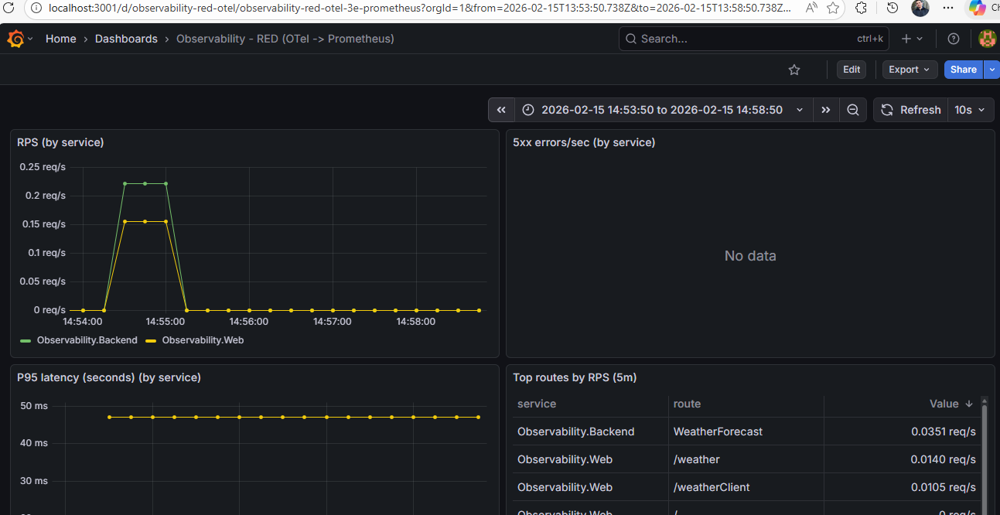
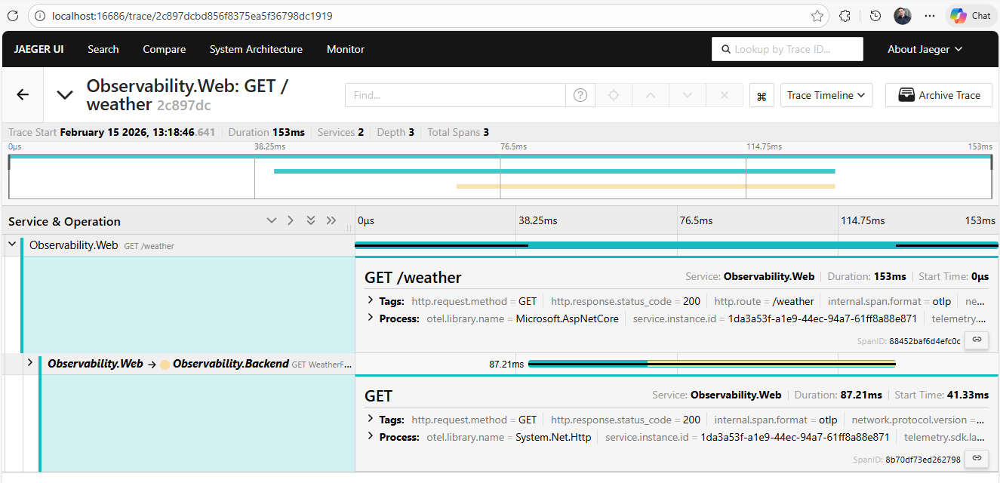
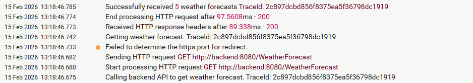
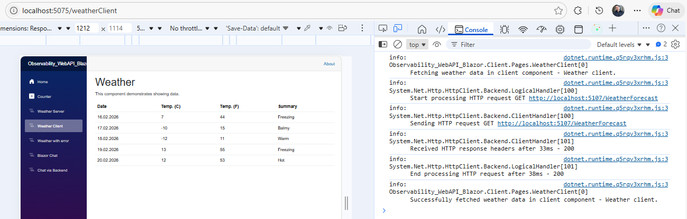
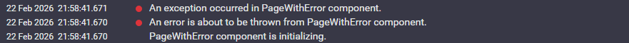

# Observability in .NET 10: Blazor Web App + Backend API with Logging, Tracing, and Metrics

A demo project showing how to wire up and use **Observability** (logging, tracing, and metrics) in a .NET 10 application composed of a **Blazor Web App** and a **Backend Web API**.

> Inspired by: [Implementing Observability in a .NET Applications — Logging, Tracing, and Metrics](https://medium.com/@faulycoelho/implementing-observability-in-a-net-applications-logging-tracing-and-metrics-67fe5b58312d)

---

## Architecture

The solution consists of two services running in Docker:

| Service | Project | Description |
|---|---|---|
| **Blazor Web App** | `Observability_WebAPI_Blazor` + `Observability_WebAPI_Blazor.Client` | Frontend built with Blazor using **Interactive Auto render mode** (Server + WebAssembly). |
| **Backend Web API** | `Observability_WebApi_Blazor.Backend` | ASP.NET Core Web API with controllers (`WeatherForecastController`, `ChatController`) and a SignalR hub (`ChatHub`). |

### Communication

```
┌──────────────┐  HTTP / SignalR   ┌──────────────┐
│  Blazor App  │ ────────────────► │  Backend API │
│              │                   │              |
└──────┬───────┘                   └──────┬───────┘
       │                                  │
       │  OTLP (traces)                   │  OTLP (traces)
       ▼                                  │
┌──────────────────┐                      │
│  OTel Collector  │◄─────────────────────┘
└────────┬─────────┘
         │
         └──────────────────────────────►┌──────────────────┐
         |                               │     Jaeger       │  ← traces UI (:16686)
         |                               └──────────────────┘
         │  Prometheus
         ▼
┌──────────────┐      ┌──────────────┐
│  Prometheus  │─────►│   Grafana    │  ← dashboards (:3001)
└──────────────┘      └──────────────┘

       Logs (Serilog → Seq)
┌──────────────┐
│     Seq      │  ← logs UI (:5341)
└──────────────┘
```

- **Blazor App** calls the Backend API via `HttpClient` (`BackendChatApiClient`) and connects to SignalR hubs.
- Both services send **traces** over OTLP to the **OpenTelemetry Collector**, which forwards them to **Jaeger**.
- Both services write **logs** via **Serilog** directly to **Seq**.
- The **OpenTelemetry Collector** exports **metrics** to **Prometheus**, which are visualized in **Grafana**.

---

## Technology Stack

| Category | Tool |
|---|---|
| Framework | .NET 10, ASP.NET Core, Blazor (Interactive Auto render mode) |
| Real-time | SignalR |
| Logging | **Serilog** (`Serilog.AspNetCore`, `Serilog.Sinks.Seq`, `Serilog.Sinks.Console`) |
| Log aggregation | **Seq** |
| Tracing | **OpenTelemetry** (`OpenTelemetry.Instrumentation.AspNetCore`, `OpenTelemetry.Instrumentation.Http`, `OpenTelemetry.Exporter.OpenTelemetryProtocol`) |
| Telemetry collection | **OpenTelemetry Collector** (contrib) |
| Trace storage | **Jaeger** |
| Metrics | **Prometheus** |
| Metrics visualization | **Grafana** |
| Containerization | **Docker** & **Docker Compose** |

---

## Blazor Pages

### Client pages (`Observability_WebAPI_Blazor.Client`)

All Client pages use `InteractiveAuto` render mode, meaning they first run on the server via SignalR and then switch to WebAssembly once the runtime is downloaded.

| Page | Route | Render Mode | Purpose |
|---|---|---|---|
| **Chat** | `/chat` | `InteractiveAuto` (prerender: true) | Real-time chat that connects **directly** to Blazor's own SignalR hub (`BlazorChatHub`). Demonstrates SignalR connection lifecycle logging — start, receive, close, and errors — all piped through `ILogger<Chat>`. |
| **ChatBackend** | `/chat-backend` | `InteractiveAuto` (prerender: true) | Real-time chat that sends messages through the **Backend API** (`ChatController` → `ChatHub`) instead of Blazor's hub. Shows a two-hop communication pattern: the Client calls `BackendChatApiClient` over HTTP, which broadcasts via the backend's SignalR hub. Logs both HTTP and SignalR events. |
| **WeatherClient** | `/weatherClient` | `InteractiveAuto` (prerender: false) | Fetches weather forecast data from the Backend API's `WeatherForecastController`. Created to demonstrate **cross-service HTTP tracing** — the outgoing `HttpClient` call generates an OpenTelemetry span that is correlated with the backend's incoming span in Jaeger. Logs request/response status and errors. |
| **PageWithError** | `/pageWithError` | `InteractiveAuto` | Intentionally throws an exception during `OnInitializedAsync`. Created to demonstrate **error handling and error logging** — the exception is caught, logged via `ILogger`, and re-thrown so the `ErrorBoundary` in the layout can display it. Shows how errors surface in Seq logs with full stack traces. |

---

## Observability: How It Is Wired Up and Used

### 1. Logging (Serilog → Seq)

Both server-side projects (Backend and Blazor) configure Serilog via `UseSerilog` in `Program.cs`:

```csharp
builder.Host.UseSerilog((ctx, cfg) =>
{
    cfg.MinimumLevel.Information()
       .MinimumLevel.Override("Microsoft.AspNetCore", LogEventLevel.Warning)
       .Enrich.FromLogContext();

    if (ctx.HostingEnvironment.IsDevelopment())
    {
        cfg.WriteTo.Console(
            outputTemplate: "{Timestamp:HH:mm:ss} [{Level:u3}] [{TraceId}] {Message:lj}{NewLine}{Exception}");
    }
    else
    {
        cfg.WriteTo.Console(new Serilog.Formatting.Json.JsonFormatter());
    }

    cfg.WriteTo.Seq(ctx.Configuration["Seq:Url"] ?? "http://localhost:5341");
});
```

**What this gives you:**
- Structured logging with `TraceId` in the output template — lets you correlate logs with a specific trace in Jaeger.
- Noisy infrastructure logs are filtered out: `Microsoft.AspNetCore` is set to `Warning`.
- Application code uses the standard `ILogger<T>` with semantic (structured) log messages:

```csharp
_logger.LogInformation(
    "Chat message received via HTTP. User: {User}, MessageLength: {MessageLength}",
    request.User,
    request.Message?.Length ?? 0);
```

Blazor components (`Chat.razor`, `ChatBackend.razor`, `WeatherClient.razor`, `PageWithError.razor`) also inject `ILogger<T>` to log SignalR events, HTTP requests, and errors.

Blazor includes a `LoggingHubFilter` — a SignalR hub filter that logs:
- Hub method invocations (with `Hub`, `Method`, `ConnectionId` context)
- Connection open / close events
- Hub method errors

### 2. Tracing (OpenTelemetry → OTel Collector → Jaeger)

Both Backend and Blazor configure OpenTelemetry via `AddOpenTelemetry` in `Program.cs`:

```csharp
builder.Services.AddOpenTelemetry()
    .ConfigureResource(r => r.AddService(serviceName: "Observability.Backend"))
    .WithTracing(tracing =>
    {
        tracing
            .AddAspNetCoreInstrumentation()   // automatic spans for incoming HTTP requests
            .AddHttpClientInstrumentation()    // automatic spans for outgoing HTTP requests
            .AddOtlpExporter(options =>
            {
                options.Endpoint = new Uri("http://localhost:4317");
            });
    });
```

**What this gives you:**
- Every incoming HTTP request and every outgoing `HttpClient` call automatically creates a span.
- Traces are sent over OTLP (gRPC) to the **OpenTelemetry Collector**.
- The Collector (`otel-config.yaml`) batches traces and exports them to **Jaeger**.
- Services register with different names (`Observability.Backend` and `Observability.Web`), making them easy to distinguish in Jaeger UI.

### 3. Metrics (OTel Collector → Prometheus → Grafana)

The OpenTelemetry Collector is configured to export metrics in Prometheus format:

```yaml
# otel-config.yaml
exporters:
  prometheus:
    endpoint: "0.0.0.0:8889"
    resource_to_telemetry_conversion:
      enabled: true
```

Prometheus scrapes the Collector endpoint every 15 seconds (`prometheus.yml`), and Grafana connects to Prometheus as a data source for dashboard visualization.

### Grafana: How to Read the Metrics



Grafana (http://localhost:3001, default credentials `admin` / `admin`) is used to visualize the metrics that flow through the pipeline:

`Blazor` + `Backend API` → OTLP (metrics) → `OpenTelemetry Collector` → Prometheus exporter → `Prometheus` → `Grafana`.

Typical dashboards for this demo focus on **RED metrics** (Rate, Errors, Duration) per service and per route:

- **RPS (Requests per second)** by service (e.g., `Observability.Backend`, `Observability.Web`).
- **5xx errors/sec** by service.
- **Latency percentiles** (for example P95) by service.
- **Top routes by RPS** (e.g., `WeatherForecast`, `/weather`, `/weatherClient`).

This is useful for quickly spotting:
- which service generates the most traffic,
- which endpoints are the slowest,
- and whether errors spike during load.

### End-to-End Example: What Happens When You Open the Weather Page

To see how logging and tracing work together across services, open the **Weather** page (`/weather`) in the browser. Here is the full request lifecycle and what you can observe in the tooling:

#### Step-by-step flow

1. The browser sends `GET /weather` to **Blazor** (`Observability.Web`).
2. Blazor renders the `Weather.razor` component during SSR. Inside `OnInitializedAsync`, the component logs `"Calling backend API to get weather forecast"` and makes an outgoing `HttpClient.GetFromJsonAsync("WeatherForecast")` call to the **Backend API**.
3. OpenTelemetry's `AddAspNetCoreInstrumentation` creates a **root span** for the incoming `/weather` request. `AddHttpClientInstrumentation` creates a **child span** for the outgoing HTTP call to the Backend. The trace context (`traceparent` header) is automatically propagated.
4. The **Backend API** (`Observability.Backend`) receives `GET /WeatherForecast`. Because the `traceparent` header is present, the backend's span joins the **same trace**. The `WeatherForecastController` logs `"Getting weather forecast"`.
5. The backend returns the data. Blazor logs `"Successfully received 5 weather forecasts"` and renders the HTML.

#### What you see in Jaeger



Opening the trace in Jaeger (http://localhost:16686) reveals **3 spans** across **2 services**:

| # | Service | Span | Duration | Description |
|---|---|---|---|---|
| 1 | `Observability.Web` | `GET /weather` | 153 ms | Root span — the incoming browser request handled by Blazor. Instrumented by `Microsoft.AspNetCore`. |
| 2 | `Observability.Web` | `GET` | 87 ms | Child span — the outgoing `HttpClient` call from Blazor to the Backend API. Instrumented by `System.Net.Http`. |
| 3 | `Observability.Backend` | `GET /WeatherForecast` | *(nested)* | The backend processing the request. Shares the same Trace ID because the `traceparent` header was propagated. |

The timeline clearly shows that span 2 (outgoing HTTP) is a child of span 1 (incoming request), and span 3 (backend) is nested inside span 2 — giving you a full picture of cross-service latency.

#### What you see in Seq



In Seq (http://localhost:5341) you can see logs from **both services** sharing the **same `TraceId`**:

| Timestamp | Message | TraceId | Source |
|---|---|---|---|
| 13:18:46.675 | Calling backend API to get weather forecast | `2c897dcbd856f8375ea5f36798dc1919` | Blazor (green) |
| 13:18:46.742 | Getting weather forecast | `2c897dcbd856f8375ea5f36798dc1919` | Backend API (red) |
| 13:18:46.785 | Successfully received 5 weather forecasts | `2c897dcbd856f8375ea5f36798dc1919` | Blazor (green) |

The key takeaway: **the TraceId is identical** across both services. This is because:
- Serilog's `Enrich.FromLogContext()` + the `{TraceId}` output template automatically pick up the current `Activity.TraceId` set by OpenTelemetry.
- OpenTelemetry's `HttpClientInstrumentation` propagates the `traceparent` header, so the backend inherits the same trace.
- You can copy a `TraceId` from any Seq log entry and paste it into Jaeger's **"Lookup by Trace ID"** search to jump directly to the corresponding trace — and vice versa.

### End-to-End Example: What Happens When You Open the WeatherClient Page

The **WeatherClient** page (`/weatherClient`) uses `InteractiveAutoRenderMode` (prerender disabled), which means it goes through **two distinct rendering phases**. Each phase produces logs in a different place, making this page a great way to observe how Auto render mode works under the hood.

#### Phase 1 — Server-side interactive render (logs appear in Seq)

When you first navigate to `/weatherClient`, the Blazor runtime has not yet downloaded the WebAssembly bundle. The component runs on the **server** over a SignalR circuit:

1. Blazor executes `OnInitializedAsync` on the server.
2. The component logs `"Fetching weather data in client component - Weather client"` and calls `HttpClient.GetAsync("WeatherForecast")` to the **Backend API**.
3. The Backend API logs `"Getting weather forecast"`.
4. The component logs `"Successfully fetched weather data in client component - Weather client"`.

All of these logs are written by Serilog and appear in **Seq** with the same `TraceId`:


| Timestamp | Message | TraceId | Source |
|---|---|---|---|
| 13:43:51.740 | Fetching weather data in client component - Weather client | `0de56ad74176a5ee4132306dc29a5208` | Blazor |
| 13:43:51.740 | Sending HTTP request GET `http://backend:8080/WeatherForecast` | `0de56ad74176a5ee4132306dc29a5208` | Blazor |
| 13:43:51.757 | Successfully fetched weather data in client component - Weather client | `0de56ad74176a5ee4132306dc29a5208` | Blazor |

This is functionally identical to the Weather (`/weather`) SSR page above — same cross-service tracing, same correlated `TraceId` across logs and Jaeger spans.

#### Phase 2 — Client-side WebAssembly render (logs appear in browser console)

Once the WebAssembly runtime finishes downloading, Blazor **seamlessly switches** the component from the server circuit to the browser. The component's `OnInitializedAsync` runs **again**, this time entirely inside the browser:



```
info: Observability_WebAPI_Blazor.Client.Pages.WeatherClient[0]
        Fetching weather data in client component - Weather client.
info: System.Net.Http.HttpClient.Backend.LogicalHandler[100]
        Start processing HTTP request GET http://localhost:5107/WeatherForecast
info: System.Net.Http.HttpClient.Backend.LogicalHandler[100]
        Sending HTTP request GET http://localhost:5107/WeatherForecast
info: System.Net.Http.HttpClient.Backend.ClientHandler[101]
        Received HTTP response headers after 33ms - 200
info: System.Net.Http.HttpClient.Backend.LogicalHandler[101]
        End processing HTTP request after 38ms - 200
info: Observability_WebAPI_Blazor.Client.Pages.WeatherClient[0]
        Successfully fetched weather data in client component - Weather client.
```

Key differences from Phase 1:
- The HTTP call goes directly from the **browser** to `http://localhost:5107/WeatherForecast` (the Backend API's public port), not through Blazor's server.
- Logs are written to the **browser console** via `Microsoft.Extensions.Logging.Console`, not Serilog/Seq.
- There is no `TraceId` in the browser console because the WebAssembly runtime does not have OpenTelemetry tracing configured.

#### Why this matters

This page demonstrates a fundamental aspect of the **Interactive Auto render mode**: the same `OnInitializedAsync` code runs in two completely different environments. From an observability perspective:

| Aspect | Phase 1 (Server) | Phase 2 (Client / WebAssembly) |
|---|---|---|
| Where code runs | Blazor server process | Browser (WebAssembly) |
| Log destination | **Seq** (via Serilog) | **Browser console** |
| TraceId present | ✅ Yes — via OpenTelemetry `Activity` | ❌ No — no server-side `Activity` in the browser |
| Trace in Jaeger | ✅ Yes — full cross-service trace | ❌ No — browser HTTP calls are not instrumented |
| Backend URL | `http://backend:8080` (Docker internal) | `http://localhost:5107` (public port) |

### End-to-End Example: What Happens When You Open the PageWithError Page

The **PageWithError** page (`/pageWithError`) is designed specifically to demonstrate **exception handling and error logging** in a Blazor application with full observability integration. It intentionally throws an exception during component initialization and shows how errors propagate through the system.

#### Step-by-step flow

1. The browser navigates to `/pageWithError`.
2. Because the component uses `InteractiveAuto` render mode (with prerendering enabled by default), Blazor renders it **on the server** first via SignalR.
3. During `OnInitializedAsync`, the component:
   - Logs `"PageWithError component is initializing."` at **Information** level.
   - Logs `"An error is about to be thrown from PageWithError component."` at **Error** level.
   - Throws an `InvalidOperationException` with message `"This is a simulated exception for demonstration purposes."`
   - Catches the exception, logs it with full stack trace: `"An exception occurred in PageWithError component."`
   - Re-throws the exception wrapped in a new `Exception`: `"An error occurred while initializing the component."`
4. The `ErrorBoundary` component in `MainLayout.razor` catches the exception and renders the error UI instead of the component content.
5. The user sees the error message on the page:
   - `Exception message: An error occurred while initializing the component.`
   - `Inner exception message: This is a simulated exception for demonstration purposes.`

#### What you see in Seq


---

## Getting Started

### Docker Compose (recommended)

```bash
docker-compose up --build
```

Once running, the following UIs are available:

| Service | URL |
|---|---|
| Blazor Web App | http://localhost:5075 |
| Backend API | http://localhost:5107 |
| Jaeger UI (traces) | http://localhost:16686 |
| Seq UI (logs) | http://localhost:5341 |
| Prometheus | http://localhost:9090 |
| Grafana | http://localhost:3001 (admin / admin) |

---

## Project Structure

```
├── Observability_WebApi_Blazor.Backend/      # Backend Web API
│   ├── Controllers/
│   │   ├── ChatController.cs                 # HTTP API that broadcasts messages via SignalR
│   │   └── WeatherForecastController.cs      # Weather forecast API
│   ├── Hubs/
│   │   └── ChatHub.cs                        # SignalR hub (backend)
│   ├── Models/
│   │   └── ChatMessageRequest.cs
│   ├── Program.cs                            # Serilog + OpenTelemetry setup
│   └── Dockerfile
│
├── Observability_WebAPI_Blazor/
│   ├── Observability_WebAPI_Blazor/          # Blazor host
│   │   ├── Hubs/
│   │   │   ├── BlazorChatHub.cs              # SignalR hub (Blazor)
│   │   │   └── LoggingHubFilter.cs           # SignalR filter with structured logging
│   │   ├── Components/
│   │   │   ├── Pages/                        # SSR pages (Home, Weather, Error, NotFound)
│   │   │   └── Layout/                       # MainLayout, NavMenu, ReconnectModal
│   │   ├── Program.cs                        # Serilog + OpenTelemetry setup
│   │   └── Dockerfile
│   │
│   └── Observability_WebAPI_Blazor.Client/   # Client
│       ├── Pages/
│       │   ├── Chat.razor                    # Chat via Blazor SignalR hub
│       │   ├── ChatBackend.razor             # Chat via Backend API + SignalR
│       │   ├── WeatherClient.razor           # Weather via Backend API
│       │   ├── PageWithError.razor           # Intentional error for error-handling demo
│       │   └── Counter.razor                 # Simple interactive counter
│       ├── Services/
│       │   └── BackendChatApiClient.cs       # Typed HttpClient for Backend API
│       └── Program.cs                        # WASM host setup
│
├── docker-compose.yml                        # All services + infrastructure
├── otel-config.yaml                          # OpenTelemetry Collector configuration
└── prometheus.yml                            # Prometheus configuration
```
